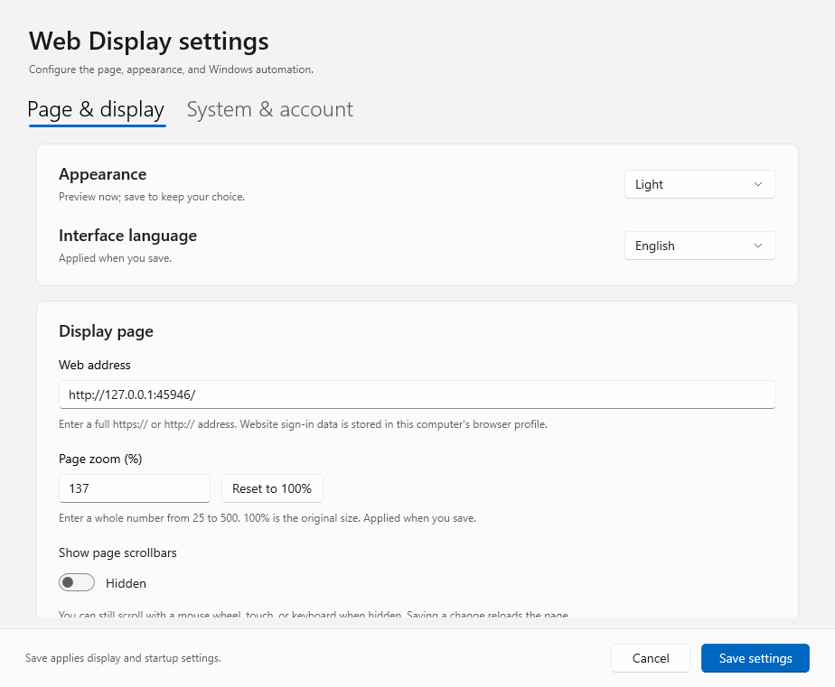
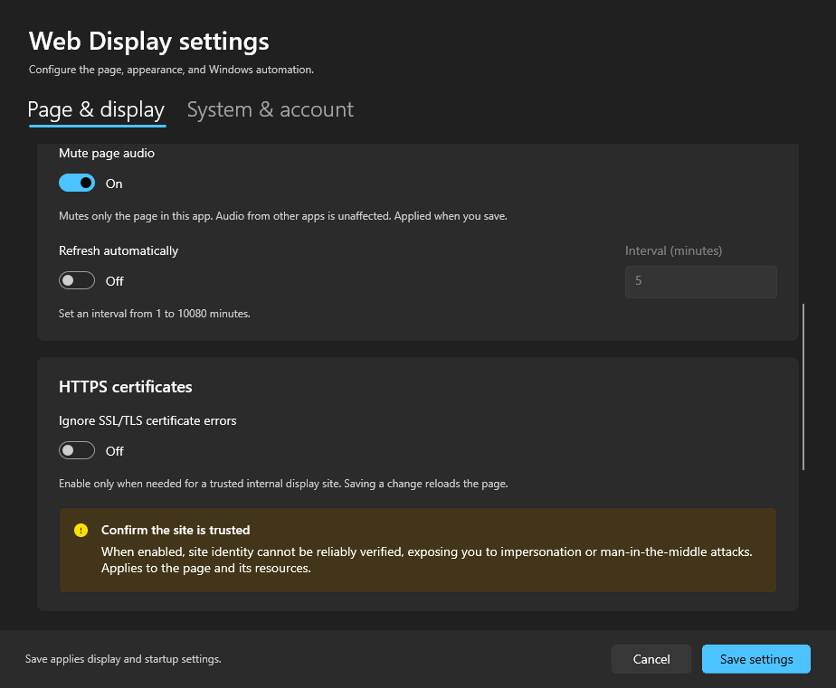

# WebDisplay 2.5.0

[简体中文](README.md) | **English**

A Windows desktop app for keeping a website on a display screen. Built with C#, .NET 10, WinUI 3, and Microsoft Edge WebView2, WebDisplay supports full screen, automatic refresh and recovery, page zoom, and unattended display settings.

Version **2.5.0** adds **Simplified Chinese, Traditional Chinese, and English** interface languages, plus a **page mute** option that takes effect without reloading the website.

[Download the latest version](https://github.com/zc929/webdisplay/releases/latest) · [All releases](https://github.com/zc929/webdisplay/releases)

## Screenshots

The English settings window in the light theme:



Page audio and related display options in the dark theme:



These are real WebDisplay 2.5.0 screenshots using a local demo URL and example settings. The defaults are 100% zoom, audio unmuted, and certificate validation enabled.

## Features

- Open a chosen website and optionally refresh it at an interval measured in minutes.
- Choose Simplified Chinese (the default), Traditional Chinese, or English; save to apply the language immediately.
- Mute audio from this app's webpage without changing system volume or other apps.
- Set page zoom from **25% to 500%**, with **100%** as the default.
- Hide standard webpage scrollbars while keeping scrolling available.
- Optionally ignore SSL/TLS server certificate errors for pages and resources loaded by this app.
- Use full screen, keep the window on top, and prevent automatic sleep while the display window is visible and not minimized.
- Preview system, light, or dark themes and manage the app from its notification-area icon.
- Retry failed page loads and recover after a browser-process failure.
- Configure startup after Windows sign-in, scheduled computer restarts, and Windows automatic sign-in.

On first launch, WebDisplay opens Settings in Simplified Chinese. Page mute, certificate-error bypass, startup, scheduled restart, and Windows automatic sign-in are **off by default**. Standard scrollbars are shown by default. Display settings and startup changes apply when you save. Scheduled restart and automatic sign-in have separate administrator action buttons: applying those actions changes system settings immediately, and canceling the Settings window does not undo them.

## Install and run

Download **`WebDisplay-Setup-2.5.0-x64.exe`** from the [latest release](https://github.com/zc929/webdisplay/releases/latest). The installer supports Simplified Chinese, Traditional Chinese, and English. You can choose the app's interface language separately after installation.

The default installation is for the current Windows user, without requiring administrator rights to install WebDisplay itself:

```text
%LOCALAPPDATA%\Programs\WebDisplay
```

Installing the app does not enable startup, scheduled restart, or automatic sign-in. The installer checks for WebView2 Runtime and, if necessary, uses Microsoft's bootstrapper to install it over the internet. If network access or organizational policy prevents this, install the Evergreen Runtime from the [Microsoft WebView2 download page](https://developer.microsoft.com/en-us/microsoft-edge/webview2/) and rerun the installer.

Start WebDisplay, enter the display URL, choose your options, and save.

For portable deployment, extract **all files** from `WebDisplay-WinUI3-win-x64.zip` to a stable location, such as `C:\Apps\WebDisplay`, and run `WebDisplay.exe`. Keep every DLL, resource, and subdirectory; copying only the EXE will not work. Moving the program after enabling startup can invalidate its startup entry.

The release targets **Windows x64**; the project's minimum Windows target version is `10.0.19041.0`. The multi-file package includes .NET 10 and WinUI 3 runtime dependencies. **WebView2 Runtime is still required**, and extracting the ZIP does not run the installer's dependency checks. This build does not have commercial code signing, so the publisher will not appear as a trusted software vendor on first launch.

Website access, network connectivity, and website authentication remain the website's responsibility. Windows automatic sign-in opens the Windows desktop; it does not enter website credentials.

## Language, audio, and display settings

Open Settings with **`Ctrl` + `,`** or the notification-area menu.

### Interface language

Select Simplified Chinese, Traditional Chinese, or English in the webpage/display settings and save. The app and tray menu update immediately, and the choice persists after restart. Cancel leaves the saved language unchanged. Existing configurations upgrade to Simplified Chinese by default. The setting translates WebDisplay's interface, not the website or text you enter.

### Page mute

Mute is off by default, including when upgrading an older configuration. Changing only the mute option and saving applies it **without refreshing the page**. Cancel preserves the current audio setting.

Mute covers audio from the webpage and its embedded content in this WebView. It does not change Windows volume or audio in other apps. Turning it off restores the website's usual audio behavior. The saved choice survives refreshes, connection retries, and browser recovery.

### Page zoom

Enter an integer from **25 to 500** and save. The default is **100%**, including for older configurations. The reset-to-100% button changes the pending value; you still need to save. The saved zoom persists through refresh and recovery.

Zoom uses CSS on the top-level webpage because this WinUI 3 WebView2 control does not expose native browser zoom. Fixed layouts, media queries, canvas, and other page features may behave differently from Edge's native zoom. Check the intended website; native PDF viewer support is not guaranteed.

### Scrollbars

Standard webpage scrollbars are shown by default. Changing this option and saving **refreshes the page**. Hiding them preserves mouse-wheel, touch, and keyboard scrolling. Restoring them returns control to the website; it does not force scrollbars onto a page that does not need them or hides them itself.

Custom website scroll controls and cross-site frames running in separate processes may still show scrollbars. The saved option persists through refresh and recovery, and cancel does not change it.

### HTTPS certificates

Ignoring SSL/TLS certificate errors is **off by default**, including after configuration upgrades. Enable it only for a trusted internal display site that requires it: bypassing these checks prevents reliable verification of the site's identity and can allow impersonation or interception.

Changing this setting and saving rebuilds the webpage session and reloads the site. Disabling it clears previous certificate exceptions and restores validation. The app retains its configuration, browser data directory, and persistent cookies, but the website may ask you to sign in again after the session is rebuilt. Cancel leaves certificate handling unchanged.

The option affects server certificate errors reported by WebView2 for this app's pages and resources. It does not change the Windows trust store or other apps, and it may not resolve TLS protocol negotiation, cipher compatibility, or mutual TLS (mTLS) client authentication failures.

### Themes and sleep prevention

Choose system, light, or dark appearance for an immediate preview. Save keeps the choice; cancel or closing Settings restores the previously saved theme. System mode follows the Windows app-color preference.

WebDisplay passes the color preference to WebView2 without forcing webpage colors. Websites that support system color preferences can respond; websites with their own fixed theme retain their behavior.

Sleep prevention keeps the computer and display awake only while WebDisplay's display window is visible and not minimized. Minimizing or exiting the app releases that request.

## Keyboard shortcuts

| Shortcut | Action |
| --- | --- |
| `F11` | Toggle full screen |
| `Esc` | Exit full screen |
| `Ctrl` + `,` | Open Settings |
| `Ctrl` + `R` | Refresh the webpage |

Shortcuts work while this app is in the foreground. The notification-area icon also provides controls.

## Startup and system settings

**Startup runs after a user signs into Windows.** For unattended use, the sequence is: computer starts → Windows signs in automatically → WebDisplay starts → website opens. Enabling app startup alone does not bypass Windows sign-in.

The startup entry belongs to the current Windows account. If automatic sign-in uses another account, sign into that account to configure its display URL and enable WebDisplay startup there.

**Scheduled restarts** use Windows Task Scheduler and can run daily or on selected weekdays, using the computer's local time. They do not require the display window to remain open. Missed restarts are not replayed at the next boot. Creating or modifying the task requires administrator authorization; canceling UAC leaves that operation incomplete.

The restart command is `shutdown /r /t 0`, without forced application closure. Other programs with unsaved work can delay or block the restart, so verify behavior on the intended display computer.

**Windows automatic sign-in** also requires administrator authorization. An elevated helper applies the system settings; ordinary display use does not require the app to stay elevated. The password is stored as a Windows LSA Secret, not in the app's ordinary settings or logs. Local administrators may still retrieve it. Use a dedicated display account where appropriate, and remember that someone with physical access can enter that account's desktop.

Domain policy, sign-in banners, and account restrictions can prevent automatic sign-in. The setting does not bypass organizational policy. Verify the account, password, and domain on the target computer, then arrange a restart test. See [Microsoft's Autologon documentation](https://learn.microsoft.com/en-us/sysinternals/downloads/autologon) for the underlying security considerations.

## Upgrade and uninstall

Exit WebDisplay, including its tray instance, before running a newer installer at the same location. Upgrades preserve display settings and website sessions because installation files and user data are separate. Installed and portable copies share the current user's default data directory, and only one instance may use the same data directory at a time.

An upgrade at the same path preserves an enabled startup entry. When moving from a portable copy to an installed copy, close the old app and re-enable startup in the installed app so that it points to the new executable.

Uninstall through Windows Installed Apps. Uninstall removes installation files and the current user's startup entry if it still points to that installation. It preserves `%LOCALAPPDATA%\WebDisplay` settings, logs, and browsing data, and does not remove the shared WebView2 Runtime.

**Scheduled restart and Windows automatic sign-in remain enabled after uninstall unless you disable them first.** To remove these system settings, open WebDisplay before uninstalling, disable each feature with its administrator action, and complete UAC authorization.

## Data and logs

The default data directory is:

```text
%LOCALAPPDATA%\WebDisplay
```

It contains ordinary settings and logs; the `BrowserProfile` subdirectory contains WebView2 website sessions and other browsing data. Automatic sign-in passwords are not stored here. Before sharing logs, check whether URLs or error messages contain internal business information.

To test with a separate app-data directory:

```powershell
.\WebDisplay.exe --data-dir C:\Temp\WebDisplay-Test
```

This isolates app data only, **not Windows system settings**. Keep startup, scheduled restart, and automatic sign-in disabled during routine testing.

## Build and validation

Building requires Windows, PowerShell 7, and the .NET 10 SDK, with NuGet access for the initial restore. The target framework is `net10.0-windows10.0.26100.0`. Direct dependencies include `Microsoft.WindowsAppSDK.WinUI 2.3.6`, `Microsoft.WindowsAppSDK.InteractiveExperiences 2.1.6`, and `Microsoft.Windows.SDK.BuildTools 10.0.26100.9169`. The complete resolved dependency list is in `src\WebDisplay\obj\project.assets.json` after restore.

NuGet supplies the XAML compiler and Windows build tools. The XAML compiler requires .NET Framework 4.7.2 or later. Installer builds need Inno Setup 6.7 or later; this release was built with 6.7.3.

```powershell
.\scripts\build.ps1
```

If Inno Setup is not found automatically:

```powershell
.\scripts\build.ps1 -InnoCompilerPath 'C:\Program Files (x86)\Inno Setup 6\ISCC.exe'
```

Use `-SkipInstaller` to skip the installer. Build outputs are:

| Output | Location |
| --- | --- |
| Multi-file app | `dist\WebDisplay-WinUI3-win-x64\WebDisplay.exe` |
| Portable ZIP | `dist\WebDisplay-WinUI3-win-x64.zip` |
| Installer | `dist\WebDisplay-Setup-2.5.0-x64.exe` |
| Source ZIP | `dist\WebDisplay-WinUI3-source.zip` |
| Source project | `src\WebDisplay\WebDisplay.csproj` |

The source package includes build scripts, `installer\WebDisplay.iss`, installer language files, and Microsoft's WebView2 bootstrapper. The bootstrapper downloads the full Runtime if needed.

The app uses unpackaged, self-contained x64 deployment with `SelfContained` and `WindowsAppSDKSelfContained` enabled, and `PublishSingleFile` and `PublishTrimmed` disabled. Inno Setup packages the complete directory. Startup loads the installed files directly. See [Microsoft's unpackaged WinUI deployment documentation](https://learn.microsoft.com/en-us/windows/apps/package-and-deploy/unpackage-winui-app).

Run the non-destructive self-checks after publishing:

```powershell
.\dist\WebDisplay-WinUI3-win-x64\WebDisplay.exe --self-test --data-dir .\artifacts\manual-self-test
```

Results are written to `self-test-result.json` in the selected data directory. Self-checks do not enable startup, configure automatic sign-in, or restart the computer.

For the interactive WinUI 3 / WebView2 smoke checks:

```powershell
.\dist\WebDisplay-WinUI3-win-x64\WebDisplay.exe --smoke-test --data-dir .\artifacts\manual-smoke-test
```

The HTTPS smoke checks require a local Node.js installation. Set `WEBDISPLAY_TEST_NODE` to an absolute `node.exe` path, or make Node available through `PATH`. The test uses a temporary local HTTPS service and keeps its self-signed certificate and private key in memory without changing the Windows trust store. Normal use, installation, and `--self-test` do not require Node.js.

The smoke test temporarily opens windows, requests and releases sleep prevention, and terminates and recreates its own test browser process. Run it in an interactive Windows session. Results and preview images are written to the test data directory.

The 2.5.0 validation record reports **23 self-checks and 48 real WinUI 3 / WebView2 runtime checks passed**, plus an installation upgrade from 2.4.0 and uninstall verification. See [the full validation record in Chinese](VALIDATION.md) for coverage and limitations. Audible output on the target device, administrator authorization, actual automatic sign-in and restarts, domain policy, website authentication, mixed-DPI monitors, missing-Runtime installation, and extended unattended operation still need validation in the deployment environment.
